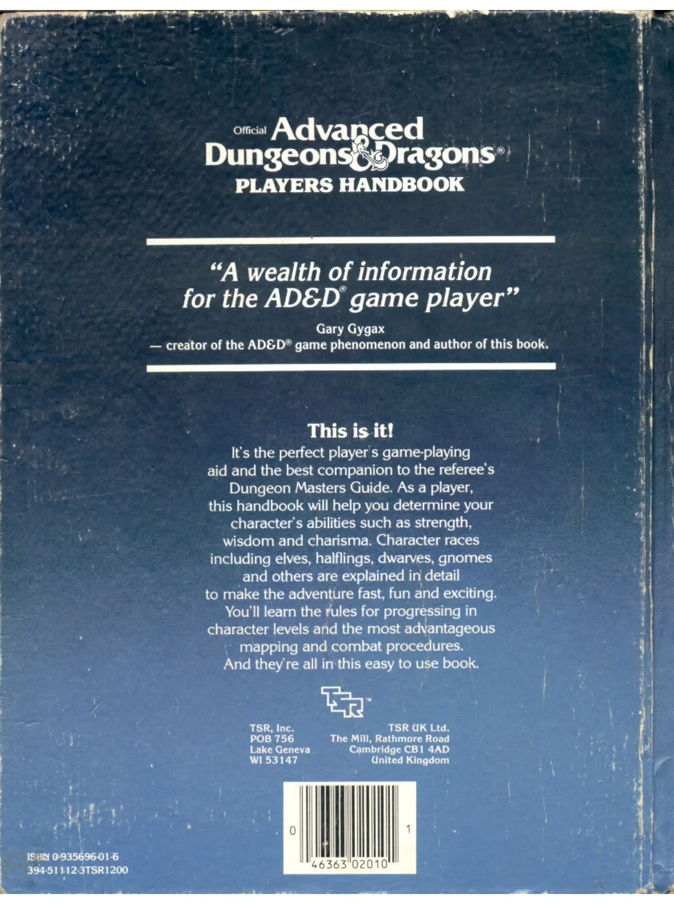

# Page 123

- model: LightOnOCR-2-1B (Best OCR)
- max_output_tokens: 8192
- source_file: TSR02010B - Player's Handbook (Revised Cover - Orange Spine).pdf
- image_link_base_url: (none)
- image_link_base_path: (none)
- generated_at: 2026-03-15T18:40:41.770Z

---
# DIVISION OF TREASURE

## APPENDIX V:

### SUGGESTED AGREEMENTS FOR DIVISION OF TREASURE

#### Agreements:

1.  Equal shares (share and share alike) is a simple division by the total number of characters involved.

2.  Shares by level is a division whereby all* character levels of experience are added and the total treasure divided by this sum. One share of treasure is given for each experience level.

3.  Equal shares plus bonus is a method to reward excellence and leadership. Treasure is divided by the sum of all characters, plus two or three. The outstanding character or characters, as determined by vote, each gain one extra share.

    *For multi-classed characters add one-half of the lesser class(es) levels to the greater class levels to determine total experience levels for the division of treasure. Characters with two classes receive shares for the class levels they are permitted to employ (cf. THE CHARACTER WITH TWO CLASSES).

#### Modifiers:

1.  Non-player characters who are henchmen of a player character count as one-half character or for one half of their levels and cannot gain bonus shares.

2.  A character incapacitated or killed (but subsequently brought back to life) is eligible to share only in treasure gained prior to such incapacity or death.

3.  Characters who are uncooperative, who obstruct the party, attack party members, or are the proximate cause of the incapacitation or death of a party member shall forfeit from one-quarter to all of their share(s) as penalty for their actions.

---

## Magical Treasure:

While it is a simple matter to total coins and precious items which can be sold for an established amount of money, the division of magic items is far more difficult. It is therefore necessary for party members to determine how magic will be divided. As the number of items which will be gained is unknown, selection of a system of division is not possible until after the adventure is concluded.

1.  If but one or two items of magic are gained these can be grouped singly or paired to equal a share of treasure. If one is of relatively small worth, it can be grouped with money to equal one share.

2.  Three or more magic items:
    a) best item
    b) next best item
    c) third + fourth items
    d) “x” amount of money as compensation for not getting any magic items

3.  Three or more magic items, alternate method:
    a) best item
    b) second item + “x” amount of money
    c) fourth item + “3x” amount of money

Magic items thus parcelled are then diced for, the character with the highest roll selecting first, and then the second highest scoring character choosing next, etc. It is suggested that each character be given a number of rolls equal to his or her level of experience, the highest of these rolls being the one retained. Non-player character henchmen are typically allowed but a single roll.

Variations on the above systems are, of course, possible. Systems should always be established prior to the inception of the adventure whenever possible.

---

    

122
