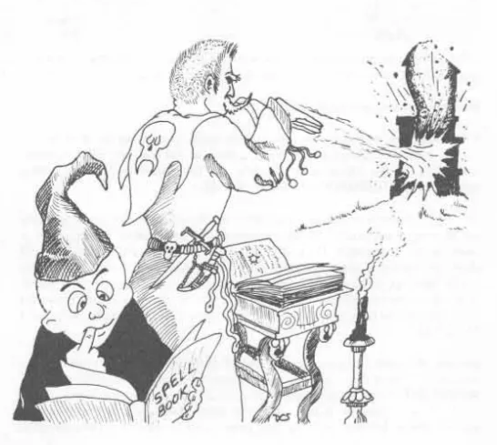

# CHARACTER ABILITIES (INTELLIGENCE)

## Intelligence:

Intelligence is quite similar to what is currently known as intelligence quotient, but it also includes mnemonic ability, reasoning, and learning ability outside those measured by the written word. Intelligence dictates the number of languages in which the character is able to converse.* Moreover, intelligence is the forte of magic-users, for they must be perspicacious in order to correctly understand magic and memorize spells. Therefore, intelligence is the major characteristic of magic-users, and those with intelligence of 16 or more gain a bonus of 10% of earned experience. Spells above 4th level cannot be learned by magic-users with minimal intelligence, and intelligence similarly dictates how many spells may be known and what level spells may be known, for only the highest intelligence is able to comprehend the mighty magics contained in 9th level spells. The tables below allow ready assimilation of the effects of intelligence on all characters — and with regard to magic-users in particular.

*Non-human characters typically are able to speak more languages than are human characters, but intelligence likewise affects the upper limit of their abilities as well, and there are racial limitations. (See CHARACTER RACES.)

## INTELLIGENCE TABLE I.

<table>
  <thead>
    <tr>
      <th>Ability Score</th>
      <th>General Information</th>
      <th>Possible Number of Additional Languages</th>
    </tr>
  </thead>
  <tbody>
    <tr><td>3</td><td></td><td>0</td></tr>
    <tr><td>4</td><td>Minimum intelligence for a half-elf character</td><td>0</td></tr>
    <tr><td>5</td><td>Here or lower the character can only be a fighter</td><td>0</td></tr>
    <tr><td>6</td><td>Minimum intelligence for a halfling character</td><td>0</td></tr>
    <tr><td>7</td><td>Minimum intelligence for a gnome character</td><td>0</td></tr>
    <tr><td>8</td><td>Minimum intelligence for an elf character</td><td>1</td></tr>
    <tr><td>9</td><td>Minimum intelligence for a paladin or magic-user character</td><td>1</td></tr>
    <tr><td>10</td><td>Minimum intelligence for use of 5th level magic spells</td><td>2</td></tr>
    <tr><td>11</td><td>Minimum intelligence for an assassin character</td><td>2</td></tr>
    <tr><td>12</td><td>Minimum intelligence for use of 6th level magic spells</td><td>3</td></tr>
    <tr><td>13</td><td>Minimum intelligence for a ranger character</td><td>3</td></tr>
    <tr><td>14</td><td>Minimum intelligence for use of 7th level magic spells</td><td>4</td></tr>
    <tr><td>15</td><td>Minimum intelligence for an illusionist character</td><td>4</td></tr>
    <tr><td>16</td><td>Minimum intelligence for use of 8th level magic spells</td><td>5</td></tr>
    <tr><td>17</td><td>Maximum intelligence for a half-orc character</td><td>6</td></tr>
    <tr><td>18</td><td>Minimum intelligence for use of 9th level magic spells</td><td>7</td></tr>
  </tbody>
</table>

## INTELLIGENCE TABLE II.: ABILITY FOR MAGIC-USERS

<table>
  <thead>
    <tr>
      <th>Ability Score</th>
      <th>Chance to Know Each Listed Spell</th>
      <th>Minimum Number of Spells/Level</th>
      <th>Maximum Number of Spells/Level</th>
    </tr>
  </thead>
  <tbody>
    <tr><td>9</td><td>35%</td><td>4</td><td>6</td></tr>
    <tr><td>10-12</td><td>45%</td><td>5</td><td>7</td></tr>
    <tr><td>13-14</td><td>55%</td><td>6</td><td>9</td></tr>
    <tr><td>15-16</td><td>65%</td><td>7</td><td>11</td></tr>
    <tr><td>17</td><td>75%</td><td>8</td><td>14</td></tr>
    <tr><td>18</td><td>85%</td><td>9</td><td>18</td></tr>
    <tr><td>19 or more</td><td>95%</td><td>10</td><td>All</td></tr>
  </tbody>
</table>

## Notes Regarding Intelligence Table II:

Each and every magic-user character must employ the Table in order to determine which and how many of each group of spells (by level) he or she can learn. At first, only the 1st level group of spells are checked. Successive level groups are checked only when the character reaches a level at which the appropriate group of spells is usable by him or her.

---

# CHARACTER ABILITIES (INTELLIGENCE)

Chance to Know Each Listed Spell pertains to the percentage chance the character has by reason of his or her intelligence to learn any given spell in the level group. The character may select spells desired in any order he or she wishes. Each spell may be checked only once. Percentile dice are rolled, and if the number generated is equal to or less than the percentage chance shown, then the character can learn and thus know that spell (it may be in his or her spell books — explained hereafter). Example: A character with an intelligence of 12 desires to know a charm person spell that he finds in a book or scroll, percentile dice are rolled, but the number generated is 52, so that spell is not understood and can not be used by the character (see, however, the paragraph below regarding the minimum number of spells knowable).

Minimum Number of Spells/Level states the fewest number of spells by level group a magic-user can learn. If one complete check through the entire group fails to generate the minimum number applicable according to intelligence score, the character may selectively go back through the group, checking each spell not able to be learned once again. This process continues until the minimum number requirement has been fulfilled. This means, then, that certain spells, when located, can be learned — while certain other spells can never be learned and the dice rolls indicate which ones are in each category. Example: The magic-user mentioned above who was unable to learn a charm person spell also fails to meet the minimum number of spells he or she can learn. The character then begins again on the list of 1st level spells, opts to see if this time charm person is able to be learned, rolls 04, and has acquired the ability to learn the spell. If and when the character locates such a spell, he or she will be capable of learning it.

Maximum Number of Spells/Level is the obverse of the minimum number which can be known. According to the character’s intelligence, this maximum number which the magic-user can possibly know (have in his or her spell books) varies from 6 to an unlimited number. As soon as this maximum is reached, the character may not check any further in the level group.

Change in Intelligence: If intelligence goes down or up for any reason, and such change is relatively permanent, the magic-user must check again as explained above for known spells by level group.

Acquisition of Heretofore Unknown Spells: Although the magic-user must immediately cease checking to determine if spells are known after the first complete check of each spell in the level group, or immediately thereafter during successive checks when the minimum number of spells which can be known is reached, it is possible to acquire knowledge of additional spells previously unknown as long as this does not violate the maximum number of spells which can be known. New spells can be gained from captured or otherwise acquired spell books or from scrolls of magic spells. In the latter event the scroll is destroyed in learning and knowing the new spell or spells. (This subject is detailed more fully in the section explaining magic-users as characters.)

10
