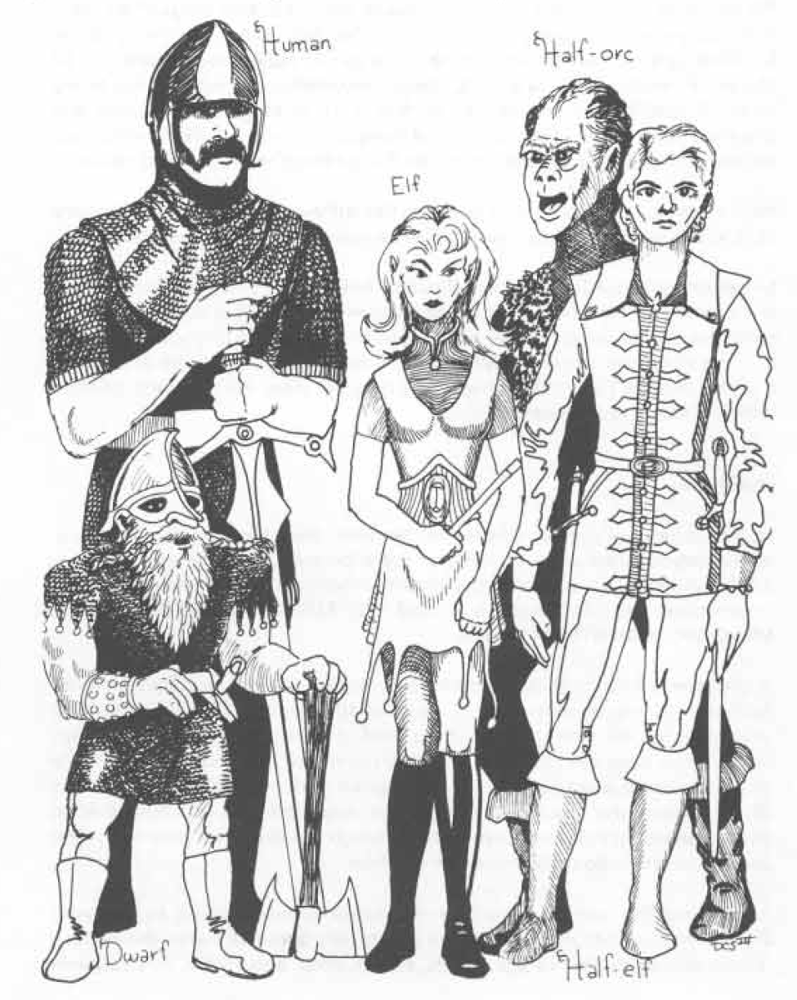

# CHARACTER RACES (HUMAN)

than that intrinsic to the class — of level they can attain within a class. As they are the rule rather than the exception, the basic information given always applies to humans, and racial changes are noted for differences as applicable for non-human or part-human stocks.

## RACIAL REFERENCES

In addition to the various attributes of the races of characters already mentioned, there are also certain likes and dislikes which must be considered in selecting a racial type for your character. The dealings which a character has with various races will be affected by racial preferences to some extent. Similarly, the acquisition of hirelings by racial type might prove difficult for some characters if they go outside a narrow field. Your Dungeon Master will certainly take racial preferences into account during interaction between your character and the various races which he or she will encounter. The following table will serve as a guide in determining which races your character will like, be rather indifferent to, or dislike.

## RACIAL PREFERENCES TABLE

### Basic Acceptability of Racial Type

<table>
  <thead>
    <tr>
      <th>Race</th>
      <th>Dwarves</th>
      <th>Elves</th>
      <th>Gnomes</th>
      <th>Half-Elves</th>
      <th>Halflings</th>
      <th>Half-Orcs</th>
      <th>Humans</th>
    </tr>
  </thead>
  <tbody>
    <tr>
      <td>DWARVEN</td>
      <td>P</td>
      <td>A</td>
      <td>G</td>
      <td>N</td>
      <td>G¹</td>
      <td>H</td>
      <td>N</td>
    </tr>
    <tr>
      <td>ELVEN</td>
      <td>A</td>
      <td>P</td>
      <td>T</td>
      <td>G</td>
      <td>T</td>
      <td>A</td>
      <td>N</td>
    </tr>
    <tr>
      <td>GNOME</td>
      <td>G</td>
      <td>T</td>
      <td>P</td>
      <td>T</td>
      <td>G</td>
      <td>H</td>
      <td>N</td>
    </tr>
    <tr>
      <td>HALF-ELVEN</td>
      <td>N</td>
      <td>P</td>
      <td>T</td>
      <td>P</td>
      <td>N</td>
      <td>A</td>
      <td>T</td>
    </tr>
    <tr>
      <td>HALFLING</td>
      <td>G²</td>
      <td>G³</td>
      <td>T</td>
      <td>N</td>
      <td>P</td>
      <td>N</td>
      <td>N</td>
    </tr>
    <tr>
      <td>HALF-ORC</td>
      <td>H</td>
      <td>A</td>
      <td>H</td>
      <td>A</td>
      <td>N</td>
      <td>P</td>
      <td>T</td>
    </tr>
    <tr>
      <td>HUMAN</td>
      <td>N</td>
      <td>N</td>
      <td>N</td>
      <td>T</td>
      <td>N</td>
      <td>N</td>
      <td>P</td>
    </tr>
  </tbody>
</table>

¹ Only with regard to Tallfellows and Stouts, other halflings are regarded with tolerance (T).

² Only Stouts regard dwarves as acceptable, other halflings tolerate them (T).

³ Only Tallfellows regard elves as good company, other halflings are tolerant (T).

### Notes on the Racial Preferences Table:

P: P indicates that the race is generally preferred, and dealings with the members of the race will be reflected accordingly.

G: G means that considerable goodwill exists towards the race.

T: T indicates that the race is viewed with tolerance and generally acceptable, if not loved.

N: N shows that the race is thought of neutrally, although some suspicion will be evidenced.

A: A means that the race is greeted with antipathy.

H: H tokens a strong hatred for the race in question.

---

# CHARACTER CLASSES (Descriptions, Functions, Levels)

Character class refers to the profession of the player character. The approach you wish to take to the game, how you believe you can most successfully meet the challenges which it poses, and which role you desire to play are dictated by character class (or multi-class). Clerics principally function as supportive, although they have some offensive spell power and are able to use armor and weapons effectively. Druids are a sub-class of cleric who operate much as do other clerics, but they are less able in combat and more effective in wilderness situations. Fighters generally seek to engage in hand-to-hand combat, for they have more hit points and better weaponry in general than do other classes. Paladins are fighters who are lawful good (see ALIGNMENT). At higher levels they gain limited clerical powers as well. Rangers are another sub-class of fighter. They are quite powerful in combat, and at upper levels gain druidic and magic spell usage of a limited sort. Magic-users cannot expect to do well in hand-to-hand combat, but they have a great number of magic spells of offensive, defensive, and informational nature. They use magic almost exclusively to solve problems posed by the game. Illusionists are a sub-class of magic-user, and they are different primarily because of the kinds of spells they use. Thieves use cunning, nimbleness, and stealth. Assassins, a sub-class of thief, are quiet killers of evil nature. Monks are aesthetic disciples of bodily training and combat with bare hands. Each class is detailed fully in succeeding paragraphs. It is up to you to select what class you desire your character to be. Selection must be modified by abilities generated and possibly by the race of your character.

The following tables will enable you to determine the major differences between character classes at a glance. Specific comparisons must be done in light of the detailed information given in the sections which discuss the individual classes in question. Note that non-human and semi-human race characters who are multi-classed are typically bound by the limitations of the thief class only. That is, a fighter/magic-user can benefit from both armor, weaponry and spells; a fighter/thief is limited by the constraints of the thief class.

18
