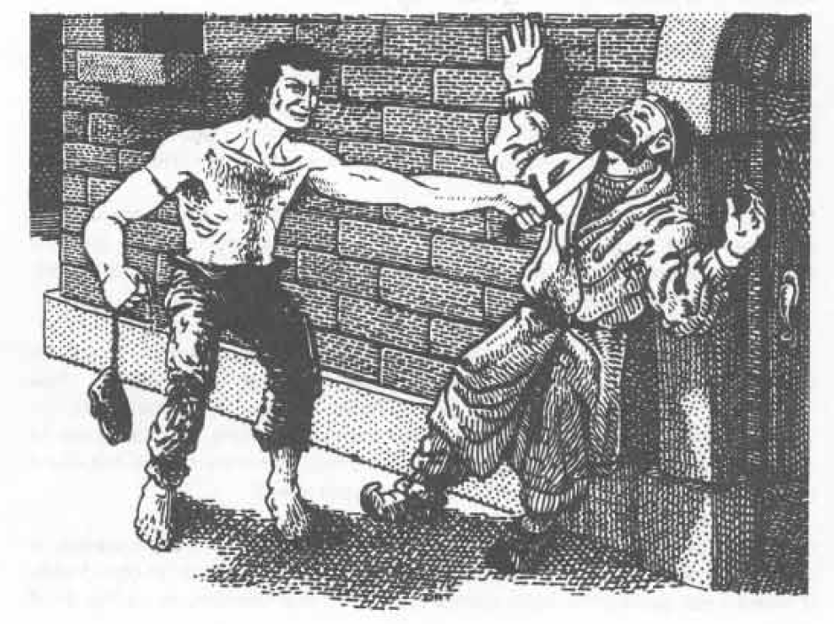

# CHARACTER CLASSES (THIEF)

than 15 gains the benefit of being able to add a bonus of 10% to experience points awarded to him or her by the referee. A glance at the CHARACTER ABILITY section preceding this will reveal that high dexterity also benefits thieves in the performance of their class functions. These functions are detailed a bit later.

All thieves are neutral or evil, although they can be neutral good (rarely), and of lawful or chaotic nature. Most thieves tend towards evil.

Thieves are principally meant to take by cunning and stealth. Thieves have six-sided hit dice (d6). They are, however, able to wear light (leather) armor and use a fair number of weapons. Although they fight only slightly more effectively than do magic-users, they are able to use stealth in combat most effectively by back stabbing. This ability is explained hereafter.

The primary functions of a thief are: 1) picking pockets, 2) opening locks, 3) finding/removing traps, 4) moving silently, and 5) hiding in shadows. These functions are basically self-explanatory. The chance for success of any performance is based on the ability level of the thief performing it. This is modified with respect to picking pockets by the experience level of his or her victim and by the powers of the observer with respect to hiding in shadows.

These functions are detailed as follows:

1. Picking pockets (or folds of a garment or a girdle) also includes such activities as pilfering and filching small items. It is done by light touch and sleight of hand.

2. Opening locks includes figuring out how to open sliding puzzle locks and foiling magical closures. It is done by picking with tools and by cleverness, plus knowledge and study of such items.

3. Finding/removing traps pertains to relatively small mechanical devices such as poisoned needles, spring blades, and the like. Finding is accomplished by inspection, and they are nullified by mechanical removal or by being rendered harmless.

4. Moving silently is the ability to move with little sound and disturbance, even across a squeaky wooden floor, for instance. It is an ability which improves with experience.

5. Hiding in shadows is the ability to blend into dark areas, to flatten oneself, and by remaining motionless when in sight, to remain unobserved. It is a function of dress and practice.

Secondary functions of a thief are: 1) listening at doors to detect sounds behind them, 2) ascending and descending vertical surfaces such as walls, and 3) back stabbing those who happen upon the thief in the performance of his or her profession.

These functions are described as follows:

1. Listening at doors includes like activity at other portals such as windows. It is accomplished by moving silently to the door and pressing an ear against it to detect sound.

2. Ascending and descending vertical surfaces is the ability of the thief to climb up and down walls. It assumes that the surface is coarse and offers ledges and cracks for toe and hand holds.

3. Back stabbing is the striking of a blow from behind, be it with club, dagger, or sword. The damage done per hit is twice normal for the weapon used per four experience levels of the thief, i.e. double damage at levels 1-4, triple at 5-8, quadruple at levels 9-12, and quintuple at levels 13-16. Note that striking by surprise from behind also increases the hit probability by 20% (+4 on the thief’s “to hit” die roll).

Additional abilities which accrue to thieves are:

1. All thieves, regardless of alignment, have their own language, the “Thieves’ Cant”. This language is known in addition to others which may be learned because of race and/or intelligence.

2. At 4th level (Burglar), thieves are able to read 20% of languages, and this ability increases by 5% with each additional level of experience until an 80% probability is attained. This enables the possible reading of instructions and treasure maps without having to resort to a magic item or spell.

3. At 10th Level (Master Thief), thieves are able to decipher magical writings and utilize scrolls of all sorts, excluding those of clerical, but not druidic, nature. However, the fact that thieves do not fully comprehend magic means that there is a 25% chance that writings will be misunderstood. Furthermore, magic spells from scrolls can be mispronounced when uttered, so that there is an increasing chance per level of the spell that it will be the reverse of its intent.

These primary, secondary, and tertiary functions are displayed on a table hereafter.

Thieves cannot build strongholds as some other classes of characters do. They can, however, build a tower or fortified building of the small castle type (q.v.) for their own safety; but this construction must be within, or not more than a mile distant from, a town or city.

Any thief character of 10th or greater level may use his small castle type building to set up a headquarters for a gang of thieves, and he or she will accordingly attract from 4-24 other thieves. However, this will bring the enmity of the local Thieves Guild, and they will struggle to do away with the rival organization. Once begun, warfare will end only when and if all the Master Thieves on either or both sides are dead, or if the thief character removes to another locale.

## THIEVES TABLE I

<table>
  <thead>
    <tr>
      <th rowspan="2">Experience Points</th>
      <th rowspan="2">Experience Level</th>
      <th colspan="2">6-Sided Dice for Accumulated Hit Points</th>
      <th rowspan="2">Level Title</th>
    </tr>
    <tr>
      <th>Hit Points</th>
      <th>Level</th>
    </tr>
  </thead>
  <tbody>
    <tr><td>0 — 1,250</td><td>1</td><td>1</td><td></td><td>Rogue (Apprentice)</td></tr>
    <tr><td>1,251 — 2,500</td><td>2</td><td>2</td><td></td><td>Footpad</td></tr>
    <tr><td>2,501 — 5,000</td><td>3</td><td>3</td><td></td><td>Cutpurse</td></tr>
    <tr><td>5,001 — 10,000</td><td>4</td><td>4</td><td></td><td>Robber</td></tr>
    <tr><td>10,001 — 20,000</td><td>5</td><td>5</td><td></td><td>Burglar</td></tr>
    <tr><td>20,001 — 42,500</td><td>6</td><td>6</td><td></td><td>Filcher</td></tr>
    <tr><td>42,501 — 70,000</td><td>7</td><td>7</td><td></td><td>Sharper</td></tr>
    <tr><td>70,001 — 110,000</td><td>8</td><td>8</td><td></td><td>Magsman</td></tr>
    <tr><td>110,001 — 160,000</td><td>9</td><td>9</td><td></td><td>Thief</td></tr>
    <tr><td>160,001 — 220,000</td><td>10</td><td>10</td><td></td><td>Master Thief</td></tr>
    <tr><td>220,001 — 440,000</td><td>11</td><td>10 + 2</td><td></td><td>Master Thief (11th level)</td></tr>
    <tr><td>440,001 — 660,000</td><td>12</td><td>10 + 4</td><td></td><td>Master Thief (12th level)</td></tr>
  </tbody>
</table>

220,000 experience points per level for each additional level beyond the 12th.

Thieves gain 2 h.p. per level after the 10th.

27
