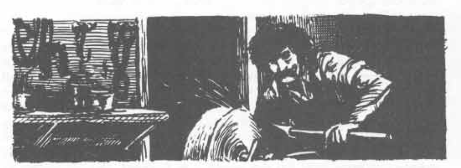

# MAGIC-USER SPELLS (6TH LEVEL)

normal troll rather than one conjured up, for instance) can pass through the shell, as can normal missiles. While a magic sword would not function magically within the shell, it would still be a sword.

## Bigby’s Forceful Hand (Evocation)

Level: 6  
Range: 1"/level  
Duration: 1 round/level  
Area of Effect: Special  

Components: V, S, M  
Casting Time: 6 segments  
Saving Throw: None  

**Explanation/Description:** Bigby’s Forceful Hand is a more powerful version of Bigby’s Interposing Hand (q.v.). It exerts a force in addition to interposing itself, and this force is sufficient to push a creature away from the spell caster if the creature weighs 500 pounds or less, to push so as to slow movement to 1" per round if the creature weighs between 500 and 2,000 pounds, and to slow movement by 50% of creatures weighing up to 8,000 pounds. It takes as many hit points to destroy as its creator has. Its material component is a glove.

## Control Weather (Alteration)

Level: 6  
Range: 0  
Duration: 4-24 hours  
Area of Effect: 4-16 square miles  

Components: V, S, M  
Casting Time: 1 turn  
Saving Throw: None  

**Explanation/Description:** Except as noted above, and for the differing material components, this spell is the same as the seventh level cleric control weather spell (q.v.). The material components of this spell are burning incense, and bits of earth and wood mixed in water.

## Death Spell (Conjuration/Summoning)

Level: 6  
Range: 1"/level  
Duration: Instantaneous  
Area of Effect: ½" square/level  

Components: V, S, M  
Casting Time: 6 segments  
Saving Throw: None  

**Explanation/Description:** When a death spell is cast, it slays creatures in the area of effect instantly and irrevocably. The number of creatures which can be so slain is a function of their hit dice:

<table>
  <thead>
    <tr>
      <th>Victim’s Hit Dice</th>
      <th>Maximum Number of Creatures Affected</th>
    </tr>
  </thead>
  <tbody>
    <tr>
      <td>less than 2</td>
      <td>4-80 (4d20)</td>
    </tr>
    <tr>
      <td>2 to 4</td>
      <td>3-30 (3d10)</td>
    </tr>
    <tr>
      <td>4+1 to 6+3</td>
      <td>2-8 (2d4)</td>
    </tr>
    <tr>
      <td>6+4 to 8+3</td>
      <td>1-4 (1d4)</td>
    </tr>
  </tbody>
</table>

If a mixed group of creatures is attacked with a death spell, use the following conversion:

<table>
  <thead>
    <tr>
      <th>Creature’s Hit Dice:</th>
      <th colspan="4">Equals Creatures with Hit Dice of:</th>
    </tr>
    <tr>
      <th></th>
      <th>less than 2</th>
      <th>2 to 4</th>
      <th>4+1 to 6+3</th>
      <th>6+4 to 8+3</th>
    </tr>
  </thead>
  <tbody>
    <tr>
      <td>6+4 to 8+3</td>
      <td>10</td>
      <td>5</td>
      <td>2</td>
      <td>-</td>
    </tr>
    <tr>
      <td>4+1 to 6+3</td>
      <td>8</td>
      <td>3</td>
      <td>-</td>
      <td>.5</td>
    </tr>
    <tr>
      <td>2 to 4</td>
      <td>4</td>
      <td>-</td>
      <td>.125</td>
      <td>.05</td>
    </tr>
  </tbody>
</table>

First, simply roll the dice to see how many creatures of less than 2 hit dice are affected, kill all these, then use the conversion to kill all 2 to 4 hit dice monsters, etc. If not enough of the number remains to kill the higher levels, they remain. This system can be reversed by applying it to higher hit dice victims first. Example: The 4d20 when rolled indicate a total of 53, 20 of this is used to kill one 6 + 4 to 8 + 3 die creature ( $20 \times .05 = 1$ ), 16 are used to kill two 4 + 1 to 6 + 3 hit dice creatures ( $16 \times .125 = 2$ ), 12 are used to kill three 2 to 4 die creatures ( $3 \times 4 = 12$ ), and 5 remainder can be used to kill off 5 less-than-2 dice creatures ( $5 \times 1 = 5$ ), i.e. $20 + 16 + 12 + 5 = 53$ . A death spell does not affect lycanthropes, undead creatures, or creatures from other than the Prime Material Plane. The material component of this spell is a crushed black pearl with a minimum value of 1000 g.p.

---

# MAGIC-USER SPELLS (6TH LEVEL)

## Disintegrate (Alteration)

Level: 6  
Range: ½"/level  
Duration: Permanent  
Area of Effect: Special  

Components: V, S, M  
Casting Time: 6 segments  
Saving Throw: Neg.

**Explanation/Description:** This spell causes matter to vanish. It will affect even matter (or energy) of a magical nature, such as Bigby’s Forceful Hand, but not a globe of invulnerability or an anti-magic shell. Disintegration is instantaneous, and its effects are permanent. Any living thing can be affected, even undead, and non-living matter up to 1" cubic volume can be obliterated by the spell. Creatures, and magical material with a saving throw, which successfully save versus the spell are not affected. Only 1 creature or object can be the target of the spell. Its material components are a lodestone and a pinch of dust.

## Enchant An Item (Conjuration/Summoning)

Level: 6  
Range: Touch  
Duration: Special  
Area of Effect: One item  

Components: V, S, M  
Casting Time: Special  
Saving Throw: Neg.

**Explanation/Description:** This is a spell which must be used by a magic-user planning to create a magic item. The enchant an item spell prepares the object to accept the magic to be placed upon or within it. The item to be magicked must meet the following tests: 1) it must be in sound and undamaged condition; 2) the item must be the finest possible, considering its nature, i.e. crafted of the highest quality material and with the finest workmanship; and 3) its cost or value must reflect the second test, and in most cases the item must have a raw materials cost in excess of 100 g.p. With respect to requirement 3), it is not possible to apply this test to items such as ropes, leather goods, cloth, and pottery not normally embroidered, bejeweled, tooled, carved, and/or engraved; however, if such work or materials can be added to an item without weakening or harming its normal functions, these are required for the item to be magicked.

The item to be prepared must be touched manually by the spell caster. This touching must be constant and continual during the casting time which is a base 16 hours plus an additional 8-64 hours (as the magic-user may never work over 8 hours per day, and haste or any other spells will not alter time required in any way, this effectively means that casting time for this spell is 2 days + 1-8 days). All work must be uninterrupted, and during rest periods the item being enchanted must never be more than 1' distant from the spell caster, for if it is, the whole spell is spoiled and must be begun again. (Note that during rest periods absolutely no other form of magic may be performed, and the magic-user must remain quiet and in isolation.) At the end of the spell, the caster will “know” that the item is ready for the final test. He or she will then pronounce the final magical syllable, and if the item makes a saving throw (which is exactly the same as that of the magic-user who magicked it) versus magic, the spell is completed. (Note that the spell caster’s saving throw bonuses also apply to the item, up to but not exceeding +3.) A result of 1 on the die (d20) always results in failure, regardless of modifications. Once the spell is finished, the magic-user may begin to place the desired dweomer upon the item, and the spell he or she plans to place on or within the item must be cast within 24 hours or the preparatory spell fades, and the item must again be enchanted.

Each spell subsequently cast upon an object bearing an enchant an item spell requires 4 hours + 4-8 additional hours per spell level of the magic being cast. Again, during casting the item must be touched by the magic-user, and during rest periods it must always be within 1' of his or her person. This procedure holds true for any additional spells placed upon the item, and each successive dweomer must be begun within 24 hours of the last, even if any prior spell failed.

83
