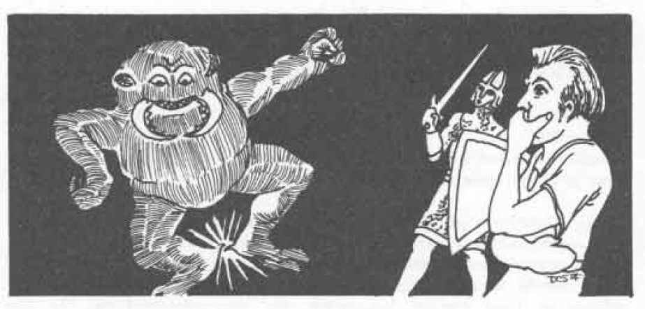

# MAGIC-USER SPELLS (8TH LEVEL)

level of experience, memories, etc. However, the duplicate is the person, so that if the original and a duplicate exist at the same time, each knows of the other’s existence; and the original person and the clone will each desire to do away with the other, for such an alter-ego is unbearable to both. If one cannot destroy the other, one (95%) will go insane (75% likely to be the clone) and destroy itself, or possibly (5%) both will become mad and commit suicide. These probabilities will occur within 1 week of the dual existence. The material component of the spell is a small piece of the flesh of the person to be duplicated. Note that the clone will become the person as he or she existed at the time at which the flesh was taken, and all subsequent knowledge, experience, etc. will be totally unknown to the clone. Also, the clone will be a physical duplicate, and possessions of the original are another matter entirely. Note that a clone takes from 2-8 months to grow, and only after that time is dual existence established.

## Glassteel (Alteration)

Level: 8  
Range: Touch  
Duration: Permanent  
Area of Effect: Object touched  

Components: V, S, M  
Casting Time: 8 segments  
Saving Throw: None  

**Explanation/Description:** The glassteel spell turns crystal or glass into a transparent substance which has the tensile strength and unbreakability of actual steel. Only a relatively small volume of material can be affected, a maximum weight of 10 pounds per level of experience of the spell caster, and it must form one whole object. The material components of this spell are a small piece of glass and a small piece of steel.

## Incendiary Cloud (Alteration-Evocation)

Level: 8  
Range: 3"  
Duration: 4 rounds + 1-6 rounds  
Area of Effect: Special  

Components: V, S, M  
Casting Time: 2 segments  
Saving Throw: ½  

**Explanation/Description:** An incendiary cloud spell exactly resembles the smoke effects of a pyrotechnics spell (q.v.), except that its minimum dimensions are a cloud of 10' height by 20' length and breadth. This dense vapor cloud billows forth, and on the 3rd round of its existence it begins to flame, causing ½ hit point per level of the magic-user who cast it. On the 4th round it does 1 hit point of damage per level of the caster, and on the 5th round it again drops to ½ h.p. of damage per level of the magic-user as its flames burn out. Any successive rounds of existence are simply harmless smoke which obscures vision within its confines. Creatures within the cloud need make only 1 saving throw if it is successful, but if they fail the first, they roll again on the 4th and 5th rounds (if necessary) to attempt to reduce damage sustained by one-half. In order to cast this spell the magic-user must have an available fire source (just as with a pyrotechnics spell), scrapings from beneath a dung pile, and a pinch of dust.

## Mass Charm (Enchantment/Charm)

Level: 8  
Range: ½"/level  
Duration: Special  
Area of Effect: Special  

Components: V  
Casting Time: 8 segments  
Saving Throw: Neg.  

**Explanation/Description:** A mass charm spell affects either persons or monsters just as a charm person spell or a charm monster spell (qq.v.) does. The mass charm, however, will affect a number of creatures whose combined levels of experience and/or hit dice does not exceed twice the level of experience of the spell caster. All affected creatures must be within the spell range and within a maximum area of 3" by 3". Note that the creatures’ saving throws are unaffected by the number of recipients (cf. charm person and charm monster), but all target creatures are subject to a penalty of -2 on the saving throw because of the efficiency and power of a mass charm spell.

## Maze (Conjuration/Summoning)

Level: 8  
Range: ½"/level  
Duration: Special  
Area of Effect: One creature  

Components: V,S  
Casting Time: 3 segments  
Saving Throw: None  

**Explanation/Description:** An extra-dimensional space is brought into being upon utterance of a maze spell. The recipient will wander in the shifting labyrinth of force planes for a period of time which is totally dependent upon its intelligence. (Note: Minotaurs are not affected by this spell.)

<table>
  <thead>
    <tr>
      <th>Intelligence of Mazed Creature</th>
      <th>Time Trapped in Maze</th>
    </tr>
  </thead>
  <tbody>
    <tr>
      <td>under 3</td>
      <td>2 to 8 turns</td>
    </tr>
    <tr>
      <td>3 to 5</td>
      <td>1 to 4 turns</td>
    </tr>
    <tr>
      <td>6 to 8</td>
      <td>5 to 20 rounds</td>
    </tr>
    <tr>
      <td>9 to 11</td>
      <td>4 to 16 rounds</td>
    </tr>
    <tr>
      <td>12 to 14</td>
      <td>3 to 12 rounds</td>
    </tr>
    <tr>
      <td>15 to 17</td>
      <td>2 to 8 rounds</td>
    </tr>
    <tr>
      <td>18 and up</td>
      <td>1 to 4 rounds</td>
    </tr>
  </tbody>
</table>

## Mind Blank (Abjuration)

Level: 8  
Range: 3"  
Duration: 1 day  
Area of Effect: One creature  

Components: V,S  
Casting Time: 1 segment  
Saving Throw: None  

**Explanation/Description:** When the very powerful mind blank spell is cast, the recipient is totally protected from all devices and/or spells which detect, influence, or read emotions and/or thoughts. Protection includes augury, charm, command, confusion, divination, empathy (all forms), ESP, fear, feeblemind, mass suggestion, phantasmal killer, possession, rulership, soul trapping, suggestion, and telepathy. Cloaking protection also extends to prevention of discovery or information gathering by crystal balls or other scrying devices, clairaudience, clairvoyance, communing, contacting other planes, or wish-related methods (wishing, limited wish, alter reality). Of course, exceedingly powerful deities would be able to penetrate the spell’s powers. Note that this spell also protects from psionic-related detection and/or influence such as domination (or mass domination), hypnosis, invisibility (the psionic sort is mind related), and precognition, plus those powers which are already covered as spells.

## Monster Summoning VI (Conjuration/Summoning)

Level: 8  
Range: 8"  
Duration: 7 rounds + 1 round/level  
Area of Effect: Special  

Components: V, S, M.  
Casting Time: 8 segments  
Saving Throw: None  

**Explanation/Description:** This spell summons 1 or 2 sixth level monsters, the creature(s) appearing in 1 to 3 rounds. See monster summoning I for other details.

## Otto’s Irresistible Dance (Enchantment/Charm)

Level: 8  
Range: Touch  
Duration: 2-5 rounds  
Area of Effect: Creature touched  

Components: V  
Casting Time: 5 segments  
Saving Throw: None  

**Explanation/Description:** When Otto’s Irresistible Dance is placed upon a creature, the spell causes the recipient to begin dancing, feet shuffling and tapping. This dance makes it impossible for the victim to do anything other than caper and prance, this covorting lowering the armor class of the creature by -4, making saving throws impossible, and negating any consideration of a shield. Note that the creature must be touched — possibly as if melee combat were taking place and the spell caster were striking to do damage.

90
