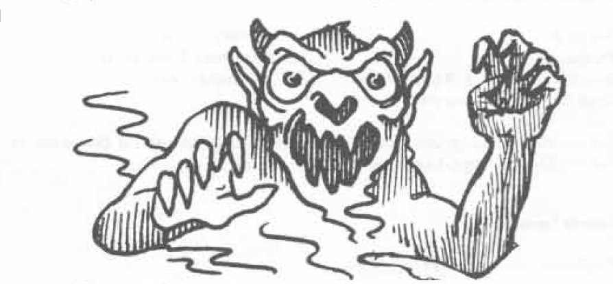

# ILLUSIONIST SPELLS (4TH LEVEL)

## Minor Creation (Alteration)

**Level:** 4  
**Range:** Touch  
**Duration:** 6 turns/level  
**Area of Effect:** Special  

**Components:** V,S,M  
**Casting Time:** 1 turn  
**Saving Throw:** None  

**Explanation/Description:** This spell enables the illusionist to create an item of non-living, vegetable nature, i.e. soft goods, rope, wood, etc. The item created cannot exceed 1 cubic foot per level of the spell caster in volume. (Cf. ADVANCED DUNGEONS & DRAGONS, MONSTER MANUAL, Djinni.) Note the limits of the spell’s duration. The spell caster must have at least a tiny piece of matter of the same type of item he or she plans to create by means of the minor creation spell, i.e. a bit of twisted hemp to create rope, a splinter of wood to create a door, and so forth.

## Phantasmal Killer (Illusion/Phantasm)

**Level:** 4  
**Range:** ½"/level  
**Duration:** 1 round/level  
**Area of Effect:** One creature  

**Components:** V,S  
**Casting Time:** 4 segments  
**Saving Throw:** Special  

**Explanation/Description:** When this spell is cast, the illusionist creates the illusion of the most fearsome thing imagined, simply by forming the fears of the subject creature’s subconscious mind into something which its conscious mind can visualize — the most horrible beast. Only the spell caster and the spell recipient can see the phantasmal killer, but if it succeeds in scoring a hit, the victim dies (from fright). The beast attacks as a 4 hit dice monster with respect to its victim. It is invulnerable to all attacks, and it can pass through any barriers, for it exists only in the beholder’s mind. The only defense against a phantasmal killer is an attempt to disbelieve, which can be tried but once, or slaying or rendering unconscious the illusionist who cast the spell. Note that the saving throw against this spell is not standard. The subject must roll three six-sided dice (3d6) and score a sum equal to or less than its intelligence ability score in order to disbelieve the apparition. The dice score is modified as follows:

<table>
  <thead>
    <tr>
      <th>Condition</th>
      <th>Modifier*</th>
    </tr>
  </thead>
  <tbody>
    <tr>
      <td>Complete surprise</td>
      <td>+2</td>
    </tr>
    <tr>
      <td>Surprise</td>
      <td>+1</td>
    </tr>
    <tr>
      <td>Subject previously attacked by this spell</td>
      <td>-1 per previous attack</td>
    </tr>
    <tr>
      <td>Subject is an illusionist</td>
      <td>-2</td>
    </tr>
    <tr>
      <td>Subject is wearing a helm of telepathy</td>
      <td>-3 plus the ability to turn the phantasmal killer upon its creator if disbelieved</td>
    </tr>
  </tbody>
</table>

*Note that magic resistance and wisdom factors also apply, magic resistance being checked first to determine spell operation (or -1 to -5 on dice if spell resistance is as that of a dwarf, gnome, etc.), and then wisdom bonus applies as a minus to the dice roll to match or score less than intelligence.

If the subject of the attack by a phantasmal killer succeeds in disbelieving and is wearing a helm of telepathy, the beast can be turned upon the illusionist, and then he or she must disbelieve it or be subject to its attack and possible effects.

## Shadow Monsters (Illusion/Phantasm)

**Level:** 4  
**Range:** 3"  
**Duration:** 1 round/level  
**Area of Effect:** 2" × 2"  

**Components:** V,S  
**Casting Time:** 4 segments  
**Saving Throw:** Special  

**Explanation/Description:** The shadow monsters spell enables the illusionist to create semi-real phantoms of one or more monsters. The total hit dice of the shadow monster or monsters thus created cannot exceed the level of experience of the illusionist; thus a 10th level illusionist can create one creature which has 10 hit dice (in normal circumstances), two which have 5 hit dice (normally), etc. All shadow monsters created by one spell must be of the same sort, i.e. hobgoblins, orcs, spectres, etc. They have 20% of the hit points they would normally have. To determine this, roll the appropriate hit dice and multiply by .20, any score less than .4 is dropped

---

# ILLUSIONIST SPELLS (5TH LEVEL)

— in the case of monsters with one (or fewer) hit dice, this indicates the monster was not successfully created — and scores of .4 or greater are rounded up to one hit point. If the creature or creatures viewing the shadow monsters fail their saving throw and believe the illusion, the shadow monsters perform as normal with respect to armor class and attack forms. If the viewer or viewers make their saving throws, the shadow monsters are armor class 10 and do only 20% of normal melee damage (biting, clawing, weapon, etc.), dropping fractional damage less than .4 as done with hit points. Example: A shadow monster dragonne attacks a person knowing it is only quasi-real. The monster strikes with 2 claw attacks and 1 bite, hitting as a 9 die monster. All 3 attacks hit, and the normal damage dice are rolled: d8 scored 5, d8 scores 8, 3d6 scores 11 and each total is multiplied by .2 (.2 × 5 = 1, .2 × 8 = 1.6 = 2, .2 × 11 = 2.2 = 2) and 5 hit points of real damage are scored upon the victim.

## Fifth Level Spells:

### Chaos (Enchantment/Charm)

**Level:** 5  
**Range:** ½"/level  
**Duration:** 1 round/level  
**Area of Effect:** up to 4" × 4"  

**Components:** V,S,M  
**Casting Time:** 5 segments  
**Saving Throw:** Special  

**Explanation/Description:** This spell is similar to the seventh level druid confusion spell (q.v.), but all creatures in the area of effect are confused for the duration of the spell. Only fighters other than paladins or rangers and illusionists are able to combat the spell effects and are thus allowed a saving throw. Similarly, monsters which do not employ magic and have intelligences of 4 (semi-intelligent) or less are entitled to saving throws.

The material component for this spell is a small disc of bronze and a small rod of iron.

### Demi-Shadow Monsters (Illusion/Phantasm)

**Level:** 5  
**Range:** 3"  
**Duration:** 1 round/level  
**Area of Effect:** 2" × 2"  

**Components:** V,S  
**Casting Time:** 5 segments  
**Saving Throw:** Special  

**Explanation/Description:** This spell is similar to the fourth level spell, shadow monsters, except that the monsters created are of 40% hit points. Damage potential is 40% of normal, and they are armor class 8.

## Major Creation (Alteration)

**Level:** 5  
**Range:** 1"  
**Duration:** 6 turns/level  
**Area of Effect:** Special  

**Components:** V,S,M  
**Casting Time:** 1 turn  
**Saving Throw:** None  

**Explanation/Description:** This spell is comparable to a minor creation spell (q.v.) except that it allows the illusionist to create mineral objects. If vegetable objects are created, they have a duration of 12 turns per level of experience of the spell caster.

## Maze (Conjuration/Summoning)

**Level:** 5  
**Range:** ½"/level  
**Duration:** Special  
**Area of Effect:** One Creature  

**Components:** V,S  
**Casting Time:** 5 segments  
**Saving Throw:** None  

**Explanation/Description:** This spell, except as noted above, is the same as the eighth level magic-user maze spell (q.v.).

98
