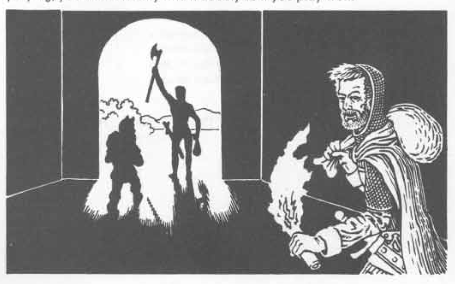

# SUCCESSFUL ADVENTURES

trusted person, and a “will” of some sort written out so that the DM will not balk at the arrangements made to assure the smooth transition of goods to the devoted “relative” of the defunct character if those sore straits should ever come to pass.

With everything just about all set to go, a few more touches will be of great help. Assign formations for the group — 10’ corridor, 20’ corridor, door opening, and any other formation which your party might commonly assume. It is always a wise idea to have the very short characters in the front rank, elves and dwarves to the flanks, and at least one sturdy fighter in the rear if the party is sufficiently large. Draw these formations out on paper (possibly your referee will require copies for reference), identifying each character carefully. The leader who is to make decisions and give directions for the party must be in the front rank, or in the second rank if he or she is tall compared to the characters before. The leader should keep a sketch or trailing map as the adventure gets underway, and another member of the expedition should keep a carefully drawn map as well.

A word about mapping is in order. A map is very important because it helps assure that the party will be able to return to the surface. Minor mistakes are not very important. It makes no difference if there is a 20’ error somewhere as long as the chart allows the group to find its way out! As it is possible that one copy of the party’s map might be destroyed by mishap or monster, the double map is a good plan whenever possible — although some players have sufficiently trained recall so as to be able to find their way back with but small difficulty, and these individuals are a great boon to the group. If pursuit prevents mapping, always go in a set escape pattern if possible — left-straight-right-straight, etc. Such patterns are easy to reverse. In mazes always follow one wall or the other, left or right, and you will never get lost. If transported or otherwise lost, begin mapping on a fresh sheet of paper, and check for familiar or similar places as you go along. Never become despondent; fight until the very end.

When everything is all set, it will take only a very few minutes to organize the group for the adventure once time for actual play begins. Your referee will certainly appreciate this, for his or her enjoyment comes from adventuring, not from waiting for a party to get their act together. With your objective all set, it will also be a relatively quick trek to the “jumping off” area, as the expedition leader will be able to give clear and concise directions on how to get there to the DM, and that means there will be few monster dice, for the party is marching along quickly down known passages, not mapping or otherwise tarrying.

Avoid unnecessary encounters. This advice usually means the difference between success and failure when it is followed intelligently. Your party has an objective, and wandering monsters are something which stand between them and it. The easiest way to overcome such difficulties is to avoid the interposing or trailing creature if at all possible. Wandering monsters typically weaken the party through use of equipment and spells against them, and they also weaken the group by inflicting damage. Very few are going to be helpful; fewer still will have anything of any value to the party. Run first and ask questions later. In the same vein, shun encounters with creatures found to be dwelling permanently in the dungeon (as far as you can tell, that is) unless such creatures are part of the set objective or the monster stands between the group and the goal it has set out to gain. Do not be sidetracked. A good referee will have many ways to distract an expedition, many things to draw attention, but ignore them if at all possible. The mappers must note all such things, and another expedition might be in order another day to investigate or destroy something or some monster, but always stay with what was planned if at all possible, and wait for another day to handle the other matters. This not to say that something hanging like a ripe fruit ready to be plucked must be bypassed, but be relatively certain that what appears to be the case actually is. Likewise, there are times when objectives must be abandoned.

If the party becomes lost, the objective must immediately be changed to discovery of a way out. If the group becomes low on vital equipment or spells, it should turn back. The same is true if wounds and dead members have seriously weakened the group’s strength. The old statement about running away to fight another day holds true in the game. It is a wise rule to follow.

On the other hand, if the party gains its set goal and is still quite strong, some other objectives can be established, and pursuit of them can then be followed. It is of utmost importance, however, to always carry slain members of the expedition with the party if at all possible, so even if but a lone character is lost, it is usually best to turn back and head for the surface.

---

# SUCCESSFUL ADVENTURES

Co-operation assumes mutual trust and confidence, and this is enhanced when members are certain that the survivors will do their best to see that any slain character is carried forth from the dungeon to be resurrected if at all possible. All members of the expedition should be ready and willing to part with any goods, money, and magic items in order to save lives. Failing that, each should be willing to fight to the death to assure the survival and success of the party. This will happen when mutual trust exists. What about evil alignment? selfish neutrals? unco-operative players?

Intelligent players of evil alignment will certainly be ready to help in order to further their own ends. This is not to say that they will be chummy with those of good alignment, but on a single expedition basis it is possible to arrange situations where they are very likely to desire to be helpful in order to benefit themselves and their cause. Generally evil characters, particularly chaotic evil ones, are prone to be troublesome and hurtful to the party. They should accordingly be shunned when possible. Selfish neutrals are similar to evil characters, but their price is usually easier to meet, and it is therefore easier to integrate them into an expedition which will depend on co-operation for success. The character of good alignment who is basically unco-operative — often acting as an evil or (selfish) neutral would — is another matter, for such players usually join under the pretense of being helpful and willing to act in the best interest of the party. Undoubtedly the best way to take care of such players is to expel them from the group as soon as circumstances permit. Do this as often as is necessary to either change the player’s mind about co-operation, or until he or she becomes tired of having their characters consigned to oblivion because of their attitude.

So much for the underworld adventure. Most of what was said regarding successful expeditions there also applies to outdoor and city adventures as well. Preparation and mutual aid are keys to these sorts of adventures also. It is not usually possible to return to home base in the wilderness, but a place of refuge can be found and used in order to rebuild a party’s strength. The party should avoid confrontations with monsters which are obviously superior and always seek to engage monsters at an advantage. City adventures are the toughest of all, for they are more difficult to plan and prepare for. Yet with care, and a careful adherence to co-operative principles, they can be successfully handled with the guidelines stated above. Setting out with an objective in mind, having sufficient force to gain it, and not drawing undue attention to the party in the course of accomplishing the goal should serve to bring such adventures to successful conclusion.

Superior play makes the game more enjoyable for all participants, DM and players alike. It allows more actual playing time. It makes play more interesting. The DM will have to respond to superior play by extending himself or herself to pose bigger and better problems for the party to solve. This in turn means more enjoyment for the players. Successful play means long-lived characters, characters who will steadily, if not rapidly, gain levels. You will find that such characters become like old friends; they become almost real. Characters with stories related about their exploits — be they cleverly wrought gains or narrow escapes — bring a sense of pride and accomplishment to their players, and each new success adds to the luster and fame thus engendered. The DM will likewise revel in telling of such exploits...just as surely as he or she will not enjoy stories which constantly relate the poor play of his or her group! Some characters will meet their doom, some will eventually retire in favor of a new character of a different class and/or alignment; but playing well is a reward unto itself, and old characters are often remembered with fondness and pride as well. If you believe that ADVANCED DUNGEONS & DRAGONS is a game worth playing, you will certainly find it doubly so if you play well.

109
