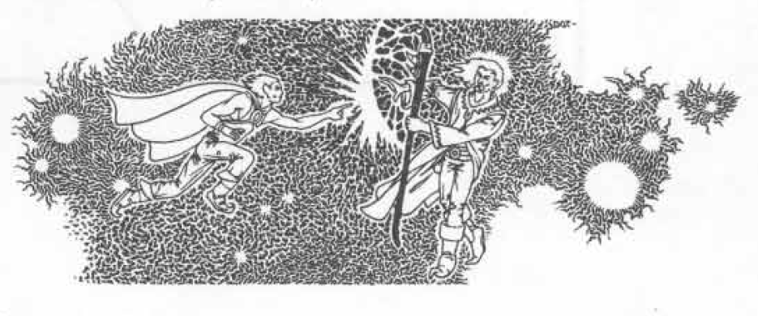

# THE KNOWN PLANES OF EXISTENCE

## APPENDIX IV: THE KNOWN PLANES OF EXISTENCE

There exist an infinite number of parallel universes and planes of existence in the fantastic “multiverse” of ADVANCED DUNGEONS & DRAGONS. All of these “worlds” co-exist, but how “real” each is depends entirely upon the development of each by the campaign referee. The chart and explanations which follow show only the various planes tied to that of normal existence. The parallel universes are not shown, and their existence might or might not be actual.

### THE INNER PLANES 1-8

1. The Prime Material Plane (or Physical Plane) houses the universe and all of its parallels. It is the plane of Terra, and your campaign, in all likelihood.

2. The Positive Material Plane is a place of energy and light, the place which is the source of much that is vital and active, the power supply for good.

3. The Negative Material Plane is the place of anti-matter and negative force, the source of power for undead, the energy area from which evil grows.

4. The Elemental Plane of Air.

5. The Elemental Plane of Fire.

6. The Elemental Plane of Earth.

7. The Elemental Plane of Water.

8. The Ethereal Plane is that which surrounds and touches all of the other Inner Planes, the endless parallel worlds of the universe, without being a part of any of them. Any creature able to become ethereal and then return to material form can use this plane to move from one to another of the Inner Planes; this is explained fully in the following paragraphs.

### THE OUTER PLANES: 9-25

9. The Astral Plane radiates from the Prime Material to a non-space where endless vortices spiral to the parallel Prime Material Planes and to the Outer Planes as well. Thus, this plane can be used to travel the universe(s) or to the Outer Planes which are the homes of powerful beings, the source of alignment (religious/philosophical/ethical ideals), the deities. Note that the Astral Plane touches only the upper layers of the Outer Planes. Use of this plane is explained later.

10. The Seven Heavens of absolute lawful good.

11. The Twin Paradises of neutral good lawfuls.

12. The planes of Elysium of neutral good.

13. The Happy Hunting Grounds of neutral good chaotics.

14. The planes of Olympus of absolute good chaotics.

15. The planes of Gladsheim (Asgard, Valhalla, Vanaheim, etc.) of chaotic good neutrals.

16. The planes of Limbo of neutral (absolute) chaos (entropy).

17. The Planes of Pandemonium of chaotic evil neutrals.

18. The 666 layers of the Abyss of absolute chaotic evil.

19. The planes of Tarterus of evil chaotic neutrals.

20. Hades’ “Three Gloom” of absolute (neutral) evil.

21. The furnaces of Gehenna of lawful evil neutrals.

22. The Nine Hells of absolute lawful evil.

23. The nether planes of Acheron of lawful evil neutrals.

24. Nirvana of absolute (neutral) lawfuls.

25. The planes of Arcadia of neutral good lawfuls.

## ETHEREAL TRAVEL

A character can achieve the ethereal state by various means which include magical ointment (oil of etherealness), magical items, magic spells and psionic discipline. It is possible to move to or about any plane which the Ethereal Plane permeates, and it is also possible to move from plane to plane ethereally.

All movement and travel in the Ethereal Plane is subject to certain hazards. Some monsters are able to function partially in this plane. Some monsters roam freely in the Ethereal Plane. The worst hazard, however, is the ether cyclone, a strong moving force which can cause the individual to enter a different world or plane or become lost in the ether for many, many days when it blows across the stretches of this multi-plane.

Ethereal travel is tireless and rapid. Creatures in ethereal state need neither food, drink, rest, or sleep.

Your referee has complete tables for encounters in the Ethereal Plane as well as for movement of the ether cyclone and its results.

## ASTRAL TRAVEL

Astral travel is possible by various means including magic spells and psionic discipline. The Astral Plane touches only the endless Prime Material Plane and the 16 “first levels” of the Outer Planes. The Astral Plane does not touch any of the Inner Planes other than the Prime Material Plane. It is possible to move about in or to any of the universes or to the first level of the Outer Planes by means of astral travel.

Travel on the Astral Plane can be dangerous due to the functioning or presence of monsters in or upon the plane. The psychic wind is the most dangerous, however, for it can either blow the traveller about so as to cause him or her to become lost (thus coming to some undesired world or plane or be out of touch for many days) or snap the silver cord (cf. astral spell, astral projection) and kill the individual irrevocably.

As with ethereal travel, movement through the Astral Plane is speedy, and while there the individual needs no food, drink, rest or even sleep.

Along with ethereal encounter and travel tables, your DM has similar information pertaining to like activities on the Astral Plane. This information will be revealed to you through experience (and possibly by other means) as the need arises.

## ETHEREAL AND ASTRAL COMBAT

It is possible to cast spells, melee, etc. on either the Ethereal or Astral Plane. These activities generally affect only others on the same plane, but can affect other creatures who exist partially or function on either or both planes. Magic spells can be cast from the Ethereal to the Prime Material Plane, but not from the Astral to the Prime Material, except as noted above.

Certain magic weapons will remain magical in either of these planes, but some will not, so be prepared for the worst. Only very powerful creatures (demon princes, arch devils, godlings, gods, etc.) can do more than destroy the astral body, causing the silver cord to return to the material body and preventing further astral travel for a period of time. Very powerful beings might be able to snap the silver cord, thus killing the astral and material bodies simultaneously. Ethereal combat damage is actual damage. Note also that all is lost if the material body is destroyed while the astral body is in that plane.

120
