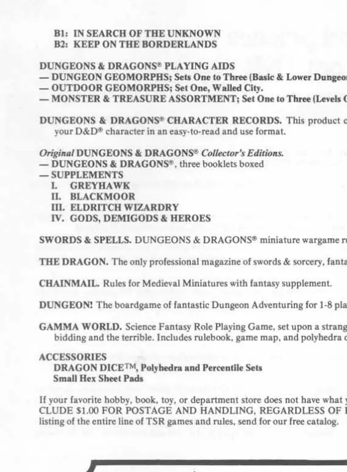
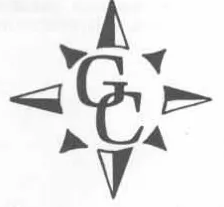

B1: IN SEARCH OF THE UNKNOWN  
B2: KEEP ON THE BORDERLANDS  

**DUNGEONS & DRAGONS® PLAYING AIDS**  
— DUNGEON GEOMORPHS; Sets One to Three (Basic & Lower Dungeons and Caves & Caverns).  
— OUTDOOR GEOMORPHS; Set One, Walled City.  
— MONSTER & TREASURE ASSORTMENT; Set One to Three (Levels One to Nine).  

**DUNGEONS & DRAGONS® CHARACTER RECORDS.** This product contains a booklet of record sheets covering every essential fact regarding your D&D® character in an easy-to-read and use format.  

**Original DUNGEONS & DRAGONS® Collector’s Editions.**  
— DUNGEONS & DRAGONS®, three booklets boxed  
— SUPPLEMENTS  
I. GREYHAWK  
II. BLACKMOOR  
III. ELDRITCH WIZARDRY  
IV. GODS, DEMIGODS & HEROES  

**SWORDS & SPELLS.** DUNGEONS & DRAGONS® miniature wargame rules for 1:10/1:1 scale.  

**THE DRAGON.** The only professional magazine of swords & sorcery, fantasy, and science fiction gaming and related fiction.  

**CHAINMAIL.** Rules for Medieval Miniatures with fantasy supplement.  

**DUNGEON!** The boardgame of fantastic Dungeon Adventuring for 1-8 players.  

**GAMMA WORLD.** Science Fantasy Role Playing Game, set upon a strange future world where nuclear disaster has altered the form of life to the forbidding and the terrible. Includes rulebook, game map, and polyhedra dice set — all in a beautifully illustrated full color box.  

**ACCESSORIES**  
DRAGON DICE™, Polyhedra and Percentile Sets  
Small Hex Sheet Pads  

If your favorite hobby, book, toy, or department store does not have what you want, you may order from us direct. ALL MAIL ORDERS MUST INCLUDE $1.00 FOR POSTAGE AND HANDLING, REGARDLESS OF HOW MANY OR HOW FEW ITEMS ARE ORDERED. For a complete listing of the entire line of TSR games and rules, send for our free catalog.  

---

  
  

    GEN CON
  

  AMERICA’S PREMIER GAME CONVENTION & TRADE SHOW

If you’re a gamer of any type, there’s an annual event you should know about no matter what your particular area of interest is. The event is GenCon, America’s Premier Game Convention and Trade Show, sponsored by TSR Hobbies, Inc. and held in August of every year at a location in southeastern Wisconsin. Over two thousand enthusiasts gather annually for this gaming extravaganza which runs events and features dealing with all facets of the hobby: tournaments, general gaming, exhibits, auctions, seminars, movies, miniatures, boardgames, role-playing events — plus special celebrity guests, prizes, and trophies. It all adds up to four days of gaming that you won’t want to miss, so make your plans now to attend!

Inquiries regarding GenCon for any particular year (including dates, general information, accommodations, etc.) should be made between March 1st and August 1st by writing to:

  
  

    GenCon 
    POB 756 
    Lake Geneva, WI 53147
  

  
  

    TSR HOBBIES, INC. 
    POB 756 
    LAKE GENEVA, WI 53147
  

