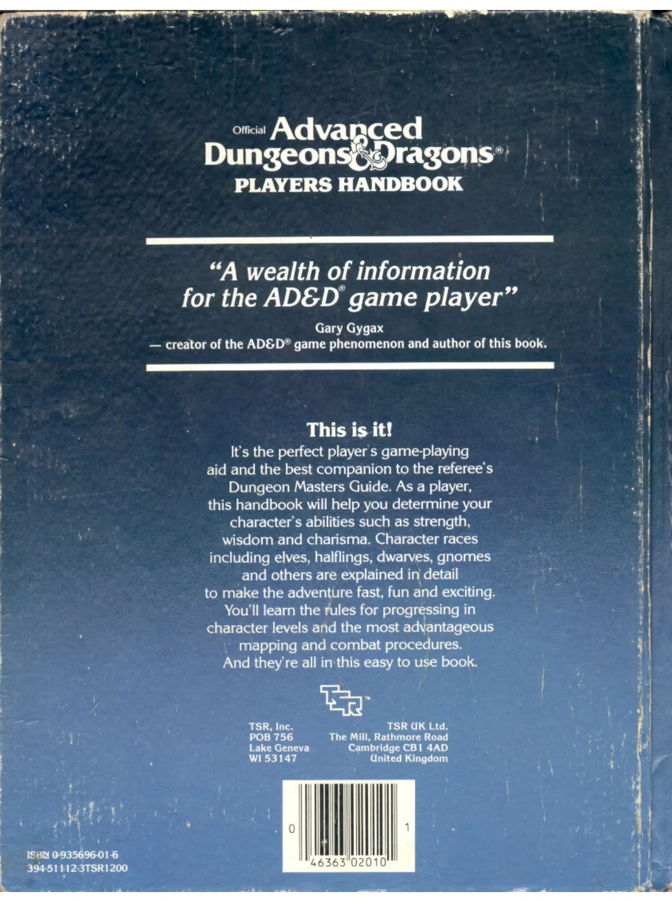

# Official Advanced Dungeons & Dragons® PLAYERS HANDBOOK

---

> “A wealth of information for the AD&D® game player”

*Gary Gygax*  
— creator of the AD&D® game phenomenon and author of this book.

---

## This is it!

It’s the perfect player’s game-playing aid and the best companion to the referee’s Dungeon Masters Guide. As a player, this handbook will help you determine your character’s abilities such as strength, wisdom and charisma. Character races including elves, halflings, dwarves, gnomes and others are explained in detail to make the adventure fast, fun and exciting. You’ll learn the rules for progressing in character levels and the most advantageous mapping and combat procedures. And they’re all in this easy to use book.

---

TSR, Inc.  
POB 756  
Lake Geneva  
WI 53147

TSR UK Ltd.  
The Mill, Rathmore Road  
Cambridge CB1 4AD  
United Kingdom

ISBN 0-935696-01-6  
394-51112-3TSR1200

0 46363 02010 1

Note: The barcode image is represented as a placeholder since actual image extraction is not possible in this format. The ISBN and barcode number are preserved as text.
